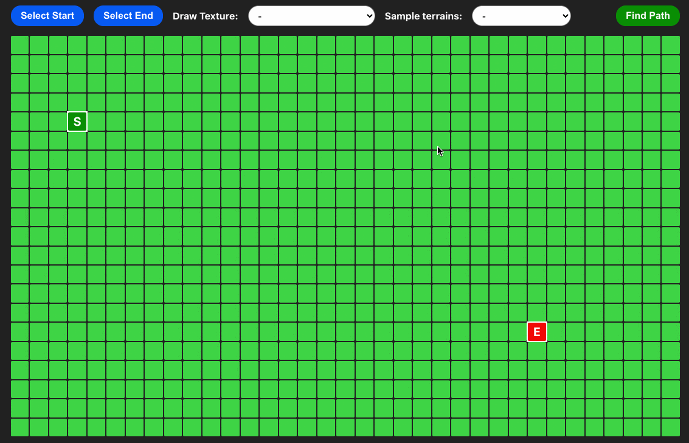

# Interactive Pathfinder

While I was building [mcfaddenpiano.com](https://github.com/shanemcfadden/mcfaddenpiano.com), I decided that I wanted my next frontend project to be an application that users could interact with instead of another static site. After watching Clément Mihailescu's [Pathfinding Visualizer](https://www.youtube.com/watch?v=msttfIHHkak) video, I decided to try to build my own variation from scratch. Although his video and application were the inspiration for this project, I chose not to reference his video or source code while building this app.

This project is a single page web application that allows users to select start and end points from a grid and calculate the easiest path between them using Dijkstra's algorithm. They can also draw textures of varying difficulties to make the easiest path more complicated (or even impossible) to find. There are also several sample terrains that the user can test out and edit.

Click [here](https://shanemcfadden.github.io/interactive-pathfinder) to use the app in your desktop browser. **Note: the app is not optimized for mobile or tablet use.**

## Tools used

- Create React App
- CSS

## Skills improved

- Display programming logic meaningfully with a UI
- Use component-by-component style sheets
- Toggle UI capabilities depending on the current application state
- Calculate style attributes dynamically using Javascript variables
- Efficiently disseminate and alter application state across components

## Possible next steps

- Implement other algorithms besides Dijkstra's
- Instead of drawing the first path found, allow algorithm to find all easiest paths, then draw the most "elegant" path based on a predetermined set of metrics (e.g. fewest turns, fewest texture changes, etc)
- Make app tablet/mobile friendly
- Allow users to draw their best guess of the easiest path and assign them a score at the end.

## Running the project locally

This project requires yarn or npm to run. If you are not using yarn, be sure to substitute `npm` in place of `yarn` when setting up the repo.

1. Clone the repository and navigate to the root directory.
2. Install any dependencies by running `yarn install`
3. To run the development server, run `yarn start`. View the app in a web browser at `localhost:3000`.

To run in a production environment, follow steps 1 and 2 above. Then run `yarn build` to compile a bundle in the /build directory. Serve this directory locally using software such as [serve](https://github.com/vercel/serve).
